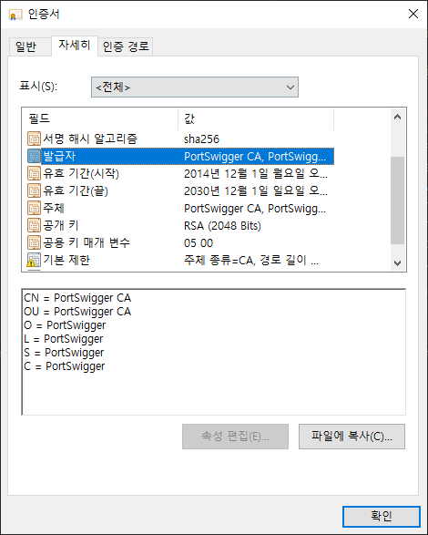
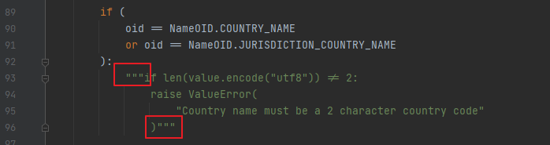
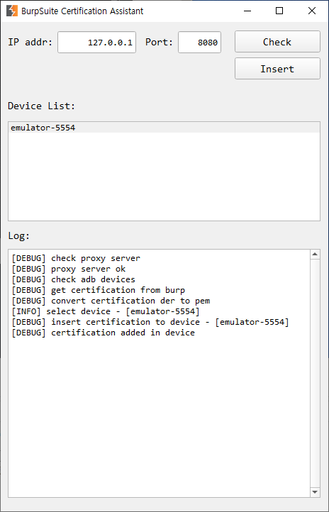

BurpCert Assistant
=================

## Prerequisites
* python3
* set adb command in environment variables
* modify cryptography package
* rooted device or emulator

## Package cryptography
* `pip install cryptography`
* burp cert's C(Country name) is 'PortSwigger' but cryptography cannot handle more than 2 characters. (ex, KR, EN, etc)
  
* modify `~\Lib\site-packages\cryptography\x509\name.py`
  

## Run

* Check
  * proxy server check
  * adb devices check
  * certification downlaod(`der`) and convert to `pem`
  * pem file name change (`suject_hash_old style`)
* Insert
  * insert pem certification to selected device(`/system/etc/security/cacerts/`)